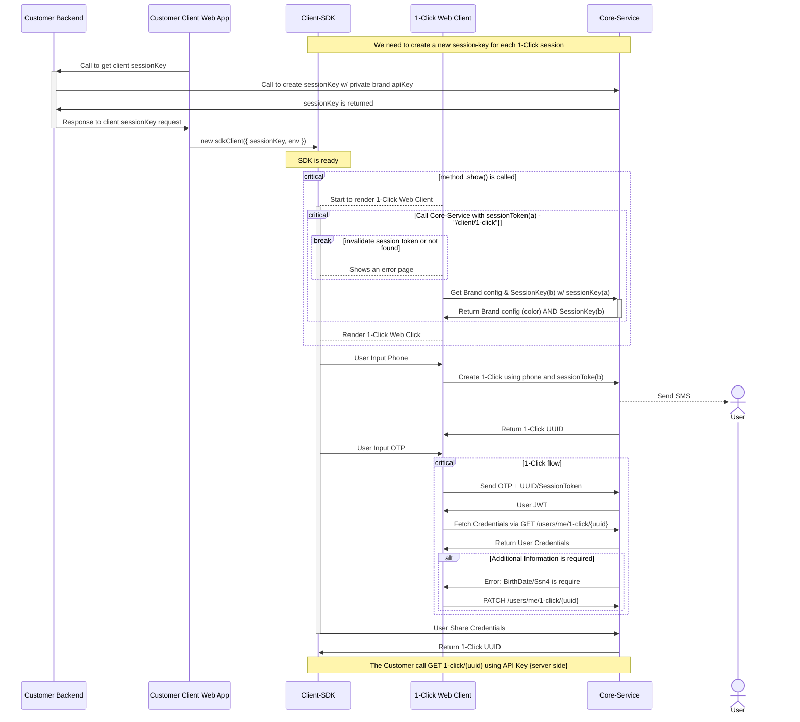

# Diagram

The sequence diagram below illustrates the complete authentication and credential sharing flow between system components:

```mermaid
---
config:
  theme: mc
---
sequenceDiagram
  participant cb as Customer Backend
  participant cc as Customer Client Web App
  participant sdk as Client-SDK
  participant 1c as 1-Click Web Client
  participant cs as Core-Service
note over sdk,cs: We need to create a new session-key for each 1-Click session
  cc ->>+ cb: Call to get client sessionKey
  cb ->> cs: Call to create sessionKey w/ private brand apiKey
  cs ->> cb: sessionKey is returned
  cb ->>- cc: Response to client sessionKey request
  cc ->> sdk: new sdkClient({ sessionKey, env })
  Note over sdk: SDK is ready
  critical method .show() is called
    1c -->+ sdk : Start to render 1-Click Web Client
    critical Call Core-Service with sessionToken(a) - "/client/1-click"}
    break invalidate session token or not found
      1c --> sdk: Shows an error page
    end
        1c ->>+ cs: Get Brand config & SessionKey(b) w/ sessionKey(a)
        cs ->>- 1c: Return Brand config (color) AND SessionKey(b)
    end
    1c --> sdk: Render 1-Click Web Click
  end
  sdk ->> 1c: User Input Phone
  1c ->> cs: Create 1-Click using phone and sessionToke(b)
  create actor u as User
  cs -->> u: Send SMS
  cs ->> 1c: Return 1-Click UUID
  sdk ->> 1c: User Input OTP
  critical 1-Click flow
    1c ->> cs: Send OTP + UUID/SessionToken
    cs ->> 1c: User JWT
    1c ->> cs: Fetch Credentials via GET /users/me/1-click/{uuid}
    cs ->> 1c: Return User Credentials
    alt  Additional Information is required
        cs ->> 1c: Error: BirthDate/Ssn4 is require
        1c ->> cs: PATCH /users/me/1-click/{uuid}
    end
  end
    sdk ->>- cs: User Share Credentials
    cs ->> sdk: Return 1-Click UUID
    note over sdk,cs: The Customer call GET 1-click/{uuid} using API Key {server side}
```
